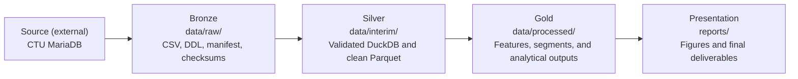

# Transaction Intelligence: Customer Segmentation and Behavioral Analytics

This project uses the Berka (PKDD'99) banking dataset to build customer-level
behavioral profiles, discover meaningful customer segments, and explore unusual
account activity. The emphasis is on exploratory data analysis, relational data
preparation, unsupervised learning, and responsible interpretation—not fraud
prediction.

## Project status

All four planned notebooks are complete: the reproducible data foundation, behavioral and
temporal analysis, customer segmentation, behavioral-outlier workflow, supervised-learning
case study, data-centric validation, and final synthesis are established.

## Structure

```text
data/       Raw, interim, and processed datasets
notebooks/  Reproducible analytical workflow
reports/    Figures and final deliverables
src/        Reusable Python package
tests/      Automated checks for data and feature logic
```

## Data architecture



| Layer | Repository location | Contents | Git policy |
|---|---|---|---|
| Source | External to the repository | Public CTU MariaDB database | Not applicable |
| Bronze | `data/raw/` | Immutable source CSV files, MariaDB DDL, provenance, and checksums | CSV data ignored; schema and manifest committed |
| Silver | `data/interim/` | Validated DuckDB database and cleaned Parquet tables | Generated data ignored |
| Gold | `data/processed/` | Customer features, segments, outliers, forecasts, and dashboard-ready tables | Generated data ignored |
| Presentation | `reports/` | Selected figures and final course deliverables | Committed when intended for reporting |

## Data

The Berka dataset files are not committed to this repository. Place the original,
unchanged files in `data/raw/` and document their source and retrieval date.

```text
Source: CTU Prague Relational Dataset Repository
Dataset: Financial — PKDD’99 Financial Dataset
Retrieved: 2026-07-17
URL: https://relational.fel.cvut.cz/dataset/Financial
```

### Downloading the dataset

After completing the setup below, provide the public CTU guest password through
an environment variable and run the downloader:

```bash
export BERKA_DB_PASSWORD='ctu-relational'
python scripts/download_berka.py
unset BERKA_DB_PASSWORD
```

Alternatively, omit the environment variable and the script will request the
password securely. It streams all eight database tables to CSV files in
`data/raw/`, so the large transaction table is never loaded fully into memory.
It also creates `download_manifest.json` with the retrieval time, row counts,
SHA-256 checksums, ordered column names and MariaDB types, primary keys, and
foreign-key relationships. The downloader compares each exact source-table row
count with the exported row count and stops if they differ. The manifest is safe
to commit because it contains metadata rather than banking records. The original
MariaDB table definitions, indexes, and constraints are retained separately in
`data/raw/schema_mariadb.sql`. Database nulls are represented in CSV as `\N` so
they remain distinguishable from empty strings.

Existing raw files are not replaced unless explicitly requested:

```bash
python scripts/download_berka.py --overwrite
```

### Building the local relational database

After downloading the snapshot, build the local DuckDB database:

```bash
python scripts/build_local_database.py
```

The builder verifies every raw-file checksum, reconstructs typed tables with
primary and foreign keys, loads parent tables before their children, compares
local and source row counts, and checks every relationship for orphaned records.
It produces:

```text
data/interim/berka.duckdb
data/interim/relationship_validation.json
```

The notebooks should query this local database rather than repeatedly accessing
the public CTU server. To intentionally rebuild it, use:

```bash
python scripts/build_local_database.py --overwrite
```

## Setup

Requires Python 3.11 or newer.

```bash
python -m venv .venv
source .venv/bin/activate
pip install -e '.[dev]'
```

## AI assistance disclosure

*I used AI as an engineering productivity tool for brainstorming, troubleshooting, and documentation, while remaining responsible for all technical decisions, implementation, testing, validation, and conclusions.*
