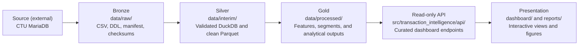

# Transaction Intelligence: Customer Segmentation and Behavioral Analytics

[](https://github.com/antonsoss/transaction-intelligence-customer-analytics/actions/workflows/tests.yml)

An MIA 5126 data science project for understanding historical banking behaviour through relational data engineering, temporal analysis, customer segmentation, and responsible interpretation.

## Overview

The project uses the Czech [Berka / PKDD'99 Financial Dataset](https://relational.fel.cvut.cz/dataset/Financial) to build account-level behavioural profiles, study banking activity over time, identify service-use associations, discover customer segments, and examine unusual account behaviour. The workflow emphasizes reproducible preparation, appropriate analytical units, transparent assumptions, and careful limits—not fraud prediction or automated customer decisions.

A read-only FastAPI service exposes selected analytical outputs, while an Angular dashboard presents the findings without exposing source account identifiers or arbitrary database access.

> [!IMPORTANT]
> **Live application:** [transaction-intelligence-customer.onrender.com](https://transaction-intelligence-customer.onrender.com)  
> The Render deployment uses free instances, so the first visit may take approximately one minute while each service starts.

### Course alignment

| Project component | Topics implemented | Related lecture material |
|---|---|---|
| `01_data_foundation_and_engineering.ipynb` | Business framing, data quality, preparation decisions, relational joins, ETL, data lineage, medallion architecture, governance, and scaling design | **MIA 5126 Week 1:** Data Science in Practice; **Week 3:** Data Preparation; **Week 4:** Data Engineering; **Week 5:** Modern Data Architectures |
| `02_behavioral_and_temporal_analysis.ipynb` | Descriptive analysis, visualization, customer features, monthly time series, SARIMA forecasting, and service-association rules | **MIA 5126 Week 2:** Exploratory Data Analysis and Visualization; **Week 6:** Time Series Analysis and Forecasting; **Week 7:** Recommendation Systems |
| `03_customer_segmentation.ipynb` | Feature selection, transformations, scaling, PCA, K-means, Gaussian mixtures, cluster evaluation, stability, profiles, and behavioural outliers | **MIA 5126 Week 8:** Clustering and Dimensionality Reduction |
| `04_validation_and_insights.ipynb` | Loan-outcome case study, leakage controls, supervised models, error analysis, data quality, explainability, limitations, and final synthesis | **MIA 5126 Week 9:** Supervised Learning Techniques; **Week 10:** Data-Centric AI and Explainability |
| FastAPI service and Angular dashboard | Frozen analytical outputs, typed HTTP/JSON endpoints, anonymous presentation data, reproducible container build, and interactive communication | **MIA 5126 final project:** Integration, interpretation, and presentation |

## Current results

The validated dataset contains 4,500 accounts and 1,056,320 transactions across 72 months from January 1993 through December 1998. Monthly active-account coverage increased from 96 to 4,424 accounts over that period and peaked at 4,483 in December 1997, so transaction totals are interpreted alongside changing account coverage.

| Result | Value |
|---|---:|
| Selected customer segments | 5 |
| Accounts meeting at least two behavioural-outlier signals | 16 |
| Retained service-association hypotheses | 5 |
| SARIMA 1998 holdout MAE | 2,321 transactions |
| Last-value / seasonal-naive MAE | 3,858 / 3,942 transactions |
| Variance explained by first two / first four principal components | 63.4% / 86.2% |
| Completed loans in supervised case study | 234 |
| Recorded problem loans | 31 |
| Logistic-regression F1 / PR-AUC | 0.55 / 0.47 |

The selected K-means solution contains 1,519 established household users, 1,305 pension-associated households, 838 high-activity multi-service users, 587 low-service cash users, and 251 high-volatility cash users. These names summarize historical patterns; they are not permanent customer labels. Forecasts, association rules, behavioural outliers, and the small loan case study are course-method demonstrations with documented limits.

## Workflow

| Component | Main output |
|---|---|
| `01_data_foundation_and_engineering.ipynb` | Four validated Silver-layer analytical tables |
| `02_behavioral_and_temporal_analysis.ipynb` | Customer features, monthly activity, forecast evaluation, and service rules |
| `03_customer_segmentation.ipynb` | Segment assignments, profiles, outliers, and fitted clustering artifacts |
| `04_validation_and_insights.ipynb` | Supervised case study, project validation, figures, and dashboard-ready tables |
| Transaction Intelligence API (FastAPI) | Read-only analytical endpoints |
| Transaction Intelligence dashboard (Angular) | Five interactive project views |
| Render deployment | Containerized public application |

## Repository structure

```text
├── .github/workflows/     # Automated Python and Angular tests
├── dashboard/             # Angular dashboard and API client
├── data/
│   ├── raw/               # Bronze source snapshot and metadata
│   ├── interim/           # Silver DuckDB database and clean relational tables
│   └── processed/         # Gold analytical and dashboard-ready outputs
├── models/                # Fitted preprocessing, PCA, and clustering artifacts
├── notebooks/             # Four-part reproducible analytical workflow
├── reports/               # Intended figures and final course deliverables
├── scripts/               # Dataset download and local-database construction
├── src/                   # Reusable Python package and FastAPI service
├── tests/                 # Data, feature-logic, and API contract checks
├── .python-version        # Exact local Python runtime: 3.14.6
├── Dockerfile             # Combined Angular and FastAPI production image
├── render.yaml            # Render Blueprint
├── requirements-api.txt   # Deployment-only Python dependencies
└── pyproject.toml         # Project metadata and analytical dependencies
```

## Data architecture



| Layer | Repository location | Contents | Git policy |
|---|---|---|---|
| Source | External to the repository | Public CTU MariaDB database | Not applicable |
| Bronze | `data/raw/` | Immutable source CSV files, MariaDB DDL, provenance, and checksums | CSV data ignored; schema and manifest committed |
| Silver | `data/interim/` | Validated DuckDB database and cleaned Parquet tables | Generated data ignored |
| Gold | `data/processed/` | Customer features, segments, outliers, forecasts, and dashboard-ready tables | Full generated data ignored; six anonymous or aggregate dashboard files committed for deployment |
| API | `src/transaction_intelligence/api/` | Read-only endpoints over selected Gold tables and report figures | Application code committed |
| Presentation | `dashboard/` and `reports/` | Angular views, selected figures, and final course deliverables | Source and intended report figures committed; builds ignored |

## Data

The Berka dataset files are not committed to this repository. Place the original,
unchanged files in `data/raw/` and document their source and retrieval date.

```text
Source: CTU Prague Relational Dataset Repository
Dataset: Financial — PKDD’99 Financial Dataset
Retrieved: 2026-07-17
URL: https://relational.fel.cvut.cz/dataset/Financial
```

### Downloading the dataset

After completing the setup below, provide the public CTU guest password through
an environment variable and run the downloader:

```bash
export BERKA_DB_PASSWORD='ctu-relational'
python scripts/download_berka.py
unset BERKA_DB_PASSWORD
```

Alternatively, omit the environment variable and the script will request the
password securely. It streams all eight database tables to CSV files in
`data/raw/`, so the large transaction table is never loaded fully into memory.
It also creates `download_manifest.json` with the retrieval time, row counts,
SHA-256 checksums, ordered column names and MariaDB types, primary keys, and
foreign-key relationships. The downloader compares each exact source-table row
count with the exported row count and stops if they differ. The manifest is safe
to commit because it contains metadata rather than banking records. The original
MariaDB table definitions, indexes, and constraints are retained separately in
`data/raw/schema_mariadb.sql`. Database nulls are represented in CSV as `\N` so
they remain distinguishable from empty strings.

Existing raw files are not replaced unless explicitly requested:

```bash
python scripts/download_berka.py --overwrite
```

### Building the local relational database

After downloading the snapshot, build the local DuckDB database:

```bash
python scripts/build_local_database.py
```

The builder verifies every raw-file checksum, reconstructs typed tables with
primary and foreign keys, loads parent tables before their children, compares
local and source row counts, and checks every relationship for orphaned records.
It produces:

```text
data/interim/berka.duckdb
data/interim/relationship_validation.json
```

The notebooks should query this local database rather than repeatedly accessing
the public CTU server. To intentionally rebuild it, use:

```bash
python scripts/build_local_database.py --overwrite
```

## Setup

The analytical workflow, data pipelines, notebooks, tests, and API use Python 3.14.6.
The exact version is declared in `.python-version` and `pyproject.toml`, and the
production container uses the matching official Python image.

```bash
git clone https://github.com/antonsoss/transaction-intelligence-customer-analytics.git
cd transaction-intelligence-customer-analytics
python3.14 --version  # Must print Python 3.14.6
python3.14 -m venv .venv
source .venv/bin/activate
python -m pip install --upgrade pip
python -m pip install -e ".[dev]"
```

The dashboard also requires a Node.js version supported by Angular 21 and pnpm 11:

```bash
cd dashboard
corepack enable
pnpm install
cd ..
```

## Run the analytical workflow

After downloading the Berka snapshot and building the local DuckDB database, open JupyterLab and run the notebooks in numerical order:

```bash
jupyter lab
```

Notebook 1 creates the Silver tables used by the rest of the project. Notebook 2 creates account-level behavioural features, monthly activity, and service rules. Notebook 3 produces the selected segments and behavioural-outlier analysis. Notebook 4 validates the project, demonstrates supervised learning, and creates the small anonymous or aggregate files consumed by the application.

## Run the Transaction Intelligence application

The application has five views:

1. **Overview** — portfolio measures, monthly activity, segment sizes, and the data journey.
2. **Banking activity over time** — monthly series, cash movement, forecasting results, and service associations.
3. **Customer segmentation** — segment profiles, PCA visualization, and anonymous behavioural-outlier cases.
4. **Validation and insights** — supervised-learning results, stability checks, limitations, and responsible-use guidance.
5. **About the project** — course information, data source, system architecture, project boundaries, and AI-assistance disclosure.

Start the FastAPI service from the repository root:

```bash
source .venv/bin/activate
uvicorn transaction_intelligence.api.main:app --reload --port 8000
```

In a second terminal, start Angular:

```bash
cd dashboard
pnpm start
```

Open `http://localhost:4200`. The Angular development server forwards `/api` requests to FastAPI. Local API documentation is available at `http://localhost:8000/docs`.

For a production-style local run, build Angular and let FastAPI serve both parts of the application:

```bash
cd dashboard
pnpm build
cd ..
uvicorn transaction_intelligence.api.main:app --host 127.0.0.1 --port 8000
```

## Deploy on Render

The repository includes a [`render.yaml`](render.yaml) Blueprint that creates one
Docker-based web service on Render.

| Service | Purpose | Health check |
|---|---|---|
| `transaction-intelligence-customer-analytics` | FastAPI API and compiled Angular dashboard | `/api/v1/health` |

The multi-stage `Dockerfile` builds the Angular dashboard and packages the FastAPI
API, six dashboard-ready Parquet files, and five intended report figures. The image
uses Python 3.14.6 and installs only the API dependencies in `requirements-api.txt`.
FastAPI serves both the compiled dashboard and the read-only API from one process.

To build and run the same container locally:

```bash
docker build -t transaction-intelligence-customer .
docker run --rm -p 10000:10000 -e PORT=10000 transaction-intelligence-customer
```

### API endpoints

| Method | Endpoint | Purpose |
|---|---|---|
| `GET` | `/api/v1/health` | Check dashboard-dataset readiness |
| `GET` | `/api/v1/summary` | Read project and portfolio summary measures |
| `GET` | `/api/v1/activity` | Read monthly banking activity |
| `GET` | `/api/v1/segments` | Read the five segment profiles |
| `GET` | `/api/v1/segments/points` | Read anonymous PCA visualization points |
| `GET` | `/api/v1/segments/{segment_id}` | Read one segment profile |
| `GET` | `/api/v1/outliers` | Read anonymous behavioural-outlier cases |
| `GET` | `/api/v1/service-rules` | Read filtered service-association hypotheses |
| `GET` | `/api/v1/validation` | Read the supervised case-study summary and limitations |
| `GET` | `/api/v1/figures/{filename}` | Read an approved validation figure |

The Angular dashboard does not query the external CTU database, run notebooks, or
load joblib artifacts. The API owns read-only access to the selected Gold datasets
and report figures, and the same endpoints can serve any HTTP client.

## Reproducible analytical contract

The numbered notebooks own data preparation, feature creation, modelling, validation, and interpretation. The application does not retrain models or query the external CTU database. It reads a fixed set of anonymous or aggregate outputs generated by the notebooks, which keeps the displayed results connected to the documented analysis.

Run the project checks with:

```bash
python -m pytest -q
cd dashboard
pnpm test
pnpm build
```

Only load project-generated joblib artifacts. Joblib uses pickle internally and is unsafe for untrusted files.

## Application scope

The project describes historical account behaviour, portfolio-level activity, service co-occurrence, customer segments, and conservative behavioural-outlier cases. The aggregate forecast estimates transaction volume, while the service rules identify hypotheses that require further validation. The loan-outcome model exists only to demonstrate supervised-learning methods from the course. None of these outputs should be used for automated lending, fraud accusations, eligibility decisions, marketing decisions, or permanent customer labels.

## AI assistance disclosure

*I used AI as an engineering productivity tool for brainstorming, troubleshooting, and documentation, while remaining responsible for all technical decisions, implementation, testing, validation, and conclusions.*

## Licence

This project is released under the [MIT License](LICENSE).
